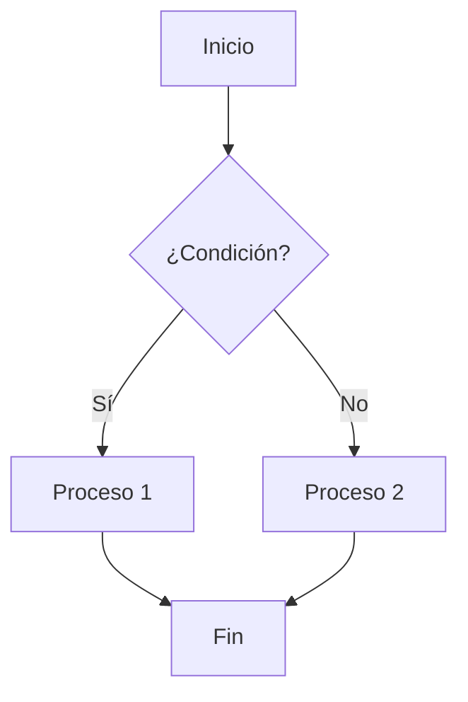

# Guía Completa de Markdown

Esta es una guía completa que demuestra todas las posibilidades de formato en Markdown.

## Encabezados

# Encabezado H1
## Encabezado H2
### Encabezado H3
#### Encabezado H4
##### Encabezado H5
###### Encabezado H6

## Énfasis y Texto

Texto en **negrita** y texto en *cursiva*.

También puedes usar __doble guión bajo__ para negrita y _guión bajo simple_ para cursiva.

Texto ~~tachado~~ para contenido eliminado.

Texto ==resaltado== (requiere extensión).

## Listas

### Lista No Ordenada

- Elemento 1
- Elemento 2
  - Sub-elemento 2.1
  - Sub-elemento 2.2
- Elemento 3

### Lista Ordenada

1. Primer elemento
2. Segundo elemento
3. Tercer elemento
   1. Sub-elemento 3.1
   2. Sub-elemento 3.2

### Lista de Tareas

- [x] Tarea completada
- [ ] Tarea pendiente
- [ ] Otra tarea pendiente

## Enlaces

[Enlace a GitHub](https://github.com)

[Enlace con título](https://github.com "GitHub")

Enlace automático: https://github.com

[Enlace de referencia][1]

[1]: https://github.com

## Imágenes


Imagen con referencia:

![Logo][logo]

[logo]: https://via.placeholder.com/150x150/28a745/ffffff?text=Logo

## Citas y Blockquotes

> Esta es una cita simple.
> Puede abarcar múltiples líneas.

> [!note] Nota Importante
> Esto es un callout de tipo nota.

> [!tip] Consejo
> Esto es un callout de tipo consejo.

> [!warning] Advertencia
> Esto es un callout de tipo advertencia.

> [!info] Información
> Esto es un callout de tipo información.

> [!error] Error
> Esto es un callout de tipo error.

## Código

### Código Inline

Usa `código inline` para fragmentos pequeños.

### Bloque de Código

```javascript
// Ejemplo de código JavaScript
function saludar(nombre) {
  console.log(`Hola, ${nombre}!`);
  return nombre;
}

const resultado = saludar('Mundo');
```

```python
# Ejemplo de código Python
def saludar(nombre):
    print(f"Hola, {nombre}!")
    return nombre

resultado = saludar("Mundo")
```

```html
<!-- Ejemplo de HTML -->
<div class="container">
  <h1>Título</h1>
  <p>Párrafo de ejemplo</p>
</div>
```

```css
/* Ejemplo de CSS */
.container {
  max-width: 1200px;
  margin: 0 auto;
  padding: 20px;
}
```

## Tablas

### Tabla Simple

| Columna 1 | Columna 2 | Columna 3 |
|-----------|-----------|-----------|
| Fila 1    | Datos     | Más datos |
| Fila 2    | Texto     | Contenido |
| Fila 3    | Ejemplo   | Demo      |

### Tabla con Alineación

| Izquierda | Centro | Derecha |
|:----------|:------:|--------:|
| Texto     | Texto  | Texto   |
| Izq       | Cen    | Der     |

## Separadores

Texto antes del separador.

---

Texto después del separador.

***

Otro separador con asteriscos.

___

Y otro con guiones bajos.

## Notas al Pie

Este texto tiene una nota al pie[^1].

Otra nota al pie aquí[^2].

Y una nota con contenido más largo[^nota-larga].

[^1]: Esta es la primera nota al pie.

[^2]: Segunda nota al pie con más información.

[^nota-larga]: Esta es una nota al pie más larga que puede contener múltiples párrafos y explicaciones detalladas sobre el tema en cuestión.

## Preguntas Frecuentes (FAQ)

::: faq
### ¿Qué es Markdown?
Markdown es un lenguaje de marcado ligero creado por John Gruber en 2004. Permite escribir texto plano con formato que se puede convertir a HTML.

### ¿Por qué usar Markdown?
- Fácil de aprender
- Legible como texto plano
- Portable entre sistemas
- Ampliamente soportado

### ¿Cómo se instala?
No necesitas instalar nada. Markdown es texto plano. Solo necesitas un editor de texto y un procesador de Markdown.

### ¿Dónde puedo usarlo?
- GitHub
- Stack Overflow
- Reddit
- Blogs y CMS
- Documentación técnica
:::

## HTML Embebido

Puedes usar HTML directamente en Markdown:

<div style="background: #f0f0f0; padding: 20px; border-radius: 8px;">
  <strong>Contenido HTML</strong>
  <p>Esto es un bloque HTML con estilos inline.</p>
</div>

<details>
<summary>Haz clic para expandir</summary>

Este contenido está oculto por defecto.

Puede contener **Markdown** dentro.

</details>

## Matemáticas (LaTeX)

Ecuación inline: $E = mc^2$

Ecuación en bloque:

$$
\frac{n!}{k!(n-k)!} = \binom{n}{k}
$$

## Diagramas (Mermaid)



## Definiciones

Término 1
: Definición del término 1

Término 2
: Definición del término 2
: Segunda definición del término 2

## Emoji

:smile: :heart: :thumbsup: :rocket: :star:

## Texto Multilínea

Este es un párrafo largo que demuestra cómo Markdown maneja el texto. Puedes escribir tanto como necesites y Markdown lo convertirá en un párrafo coherente.

Las líneas en blanco separan párrafos.

Este es otro párrafo separado del anterior por una línea en blanco.

## Conclusión

Markdown es una herramienta poderosa para escribir contenido formateado de manera simple y eficiente. Con las extensiones adecuadas, puedes crear documentos ricos y complejos manteniendo la simplicidad del texto plano.

---

**Autor:** Estudio Nebulosa  
**Fecha:** 2026-10-01  
**Versión:** 1.0
